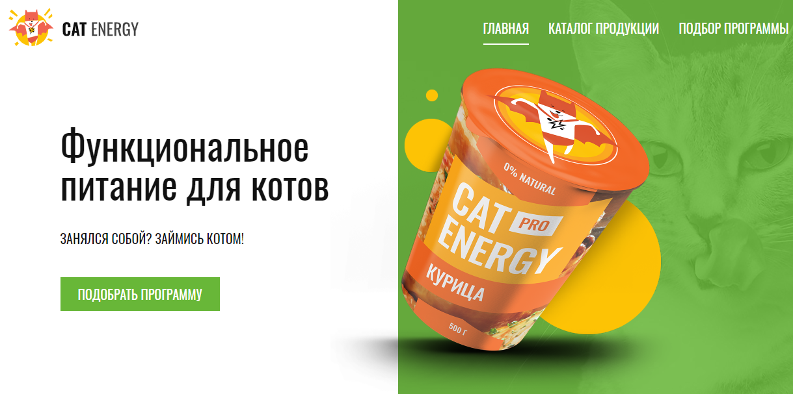

# cat-energy
### [Демо](https://fadeyush.github.io/cat-energy) версия проекта
**cat-energy** - интернет-магазин фитнес еды для котов.

Проект написан на **TypeScript** с использованием библиотелки **React**. Для хранения глобального состояния применяется хранилище **Redux** с расширением **Thunk**. Стилизован с помощью препроцессора **Sass(scss)** с использоваем modules. 

Работа с API реализована с помощью сервера [{JSON} Placeholder](https://jsonplaceholder.typicode.com/)

##  Функционал:

##  Установка и запуск приложения:

Клонировать репозиторий:

    git clone https://github.com/fadeyush/cat-energy

Запустить приложение:

    npm start

Cборка проекта и размещение его на [GitHub Pages](https://pages.github.com/)

    npm run deploy 